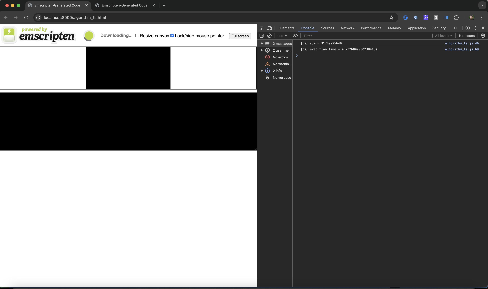
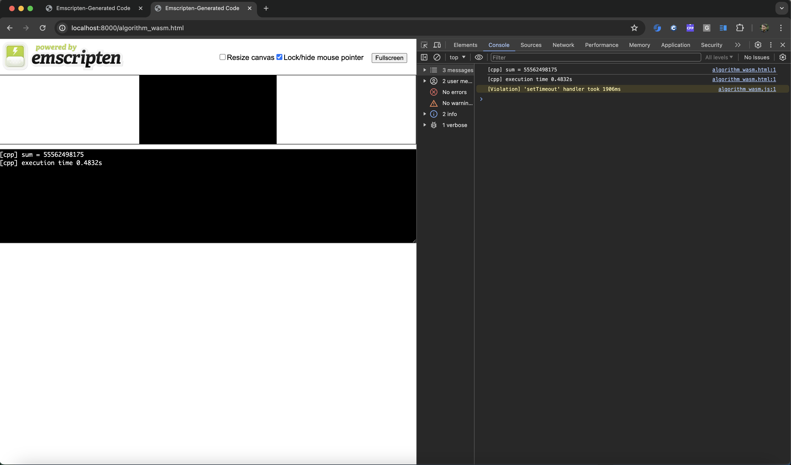
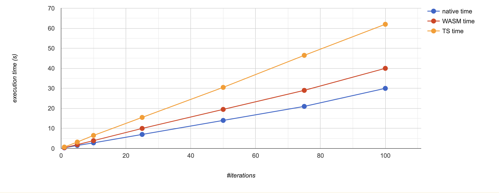

# Native vs WASM vs Typescript performance example

## Application: Premultipled to Unpremultipled Alpha algoritm example

Given a RGBA pixels, we can use the alpha (transparency) information in 2 ways:
* premultiplied alpha (A already applied to R / G / B - e.g., `R' = R * A`)
* unpremultiplied alpha (A not applied to R)

Example - RGBA pixel = `(100, 150, 200, 10)` (`R = 100`, `G = 150`, `B = 200`, `A = 10`)
* unpremultiplied `R = 100, G = 150, B = 200`
* premultiplied `R = 100 * 10 / 255 = ~3.92`, `G = 150 * 10/ 255 = ~5.88`, `B = 200 * 10 / 255 = 7.84`

If we now alpha was already applied, we convert from `(3.92, 5.88, 7.84, 10)` to `(100, 150, 200, 10)`
(e.g. `R = 3.92 * 255 / 10 = ~99.96 = ~100`).

Note: In this examples we ignored the loss of precision.


## Build

```bash
$ make
em++ -std=c++17 -Wall -Wextra   -O3 -fno-exceptions -fno-rtti  -sALLOW_MEMORY_GROWTH algorithm_wasm.cpp -o algorithm_wasm.html
tsc algorithm_ts.ts
cp algorithm_wasm.html algorithm_ts.html
gsed -i "s/algorithm_wasm/algorithm_ts/g" algorithm_ts.html
clang++ -std=c++17 -Wall -Wextra   -O3 -fno-exceptions -fno-rtti  algorithm_wasm.cpp -o algorithm_native
```

Note: Make sure that `CXXFLAGS` includes `CXXFLAGS_RELEASE` (DO NOT use `CXXFLAGS_DEBUG` for performance comparison).

## Run

Make sure you have terminal with http server started:
```bash
$ python3 -m  http.server
```

### TS algorithm in browser

* Open [http://localhost:8000/algorithm_ts.html](http://localhost:8000/algorithm_ts.html).
* Check console logs: 

### WASM algorithm in browser

* Open [http://localhost:8000/algorithm_wasm.html](http://localhost:8000/algorithm_wasm.html).
* Check console logs: 


### Native algorithm in terminal

```bash
$ time ./algorithm_native
[cpp] sum = 55562498175
[cpp] execution time 0.433055s
```

## Performance comparison

* Let's chance the number of repetitions to `100`:
```bash
$ git diff .
diff --git a/01-native-vs-wasm-ts/algorithm_ts.ts b/01-native-vs-wasm-ts/algorithm_ts.ts
index 05c759c..1a6f0b7 100644
--- a/01-native-vs-wasm-ts/algorithm_ts.ts
+++ b/01-native-vs-wasm-ts/algorithm_ts.ts
@@ -57,7 +57,7 @@ function print_sum(pixels: Uint8ClampedArray): void {
 function main(): void {
     const n: number = 250_000_000;
     const pixels: Uint8ClampedArray = generate_data(n);
-    const repeat_times: number = 1;
+    const repeat_times: number = 100;
 
     {
         // Print control sum.
diff --git a/01-native-vs-wasm-ts/algorithm_wasm.cpp b/01-native-vs-wasm-ts/algorithm_wasm.cpp
index 78db40c..2d34122 100644
--- a/01-native-vs-wasm-ts/algorithm_wasm.cpp
+++ b/01-native-vs-wasm-ts/algorithm_wasm.cpp
@@ -56,7 +56,7 @@ void print_control_sum(const std::vector<uint8_t>& pixels) {
 int main() {
     const std::size_t n = 250'000'000;
     const auto pixels = generate_data(n);
-    const auto repeat_times = 1;
+    const auto repeat_times = 100;
 
     {
         // Print control sum.
```

* Rebuild
```bash
$ make clean
$ make
```

* Results from MacBook PRO M2 MAX (each scenario was run 10 times; average values are presented):

|#iterations|Native time | WASM time | TS time |
|-|-|-|-|
|1|0.3s|0.4s|0.7s|
|5|1.5s|1.9s|3.2s|
|10|2.8s|3.9s|6.5s|
|25|7s|10s|15.5s|
|50|14s|19.5|30.5s|
|75|21.5s|29s|46.5s|
|100|30s|40s|62s|




Conclusion: WASM execution time always more closer to the the native implementation!
* WASM / native slowdown = ~ `1.33x`
* TS / native slowdown   = ~ `2x`